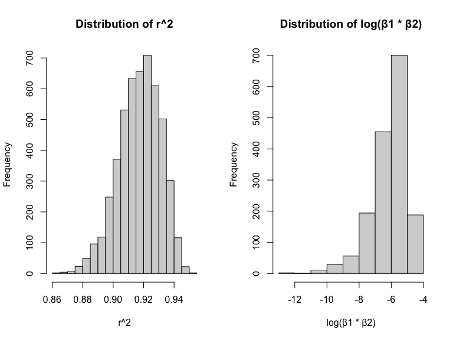
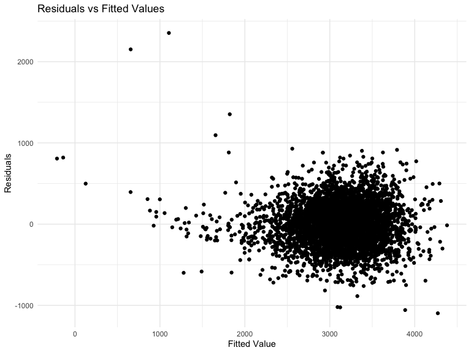
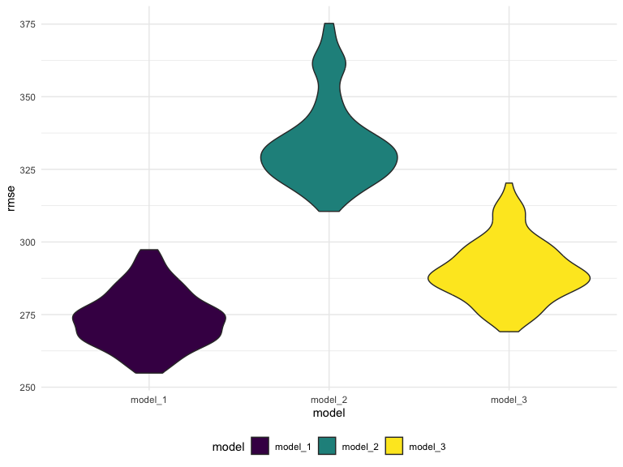

Homework 6
================
Kairui Wang
2023-11-29

Load packages

``` r
library(tidyverse)
library(ggplot2)
library(modelr)
library(broom)
```

    ## 
    ## Attaching package: 'broom'

    ## The following object is masked from 'package:modelr':
    ## 
    ##     bootstrap

# Problem 1

In the data cleaning code below we create a `city_state` variable,
change `victim_age` to numeric, modifiy victim_race to have categories
white and non-white, with white as the reference category, and create a
`resolution` variable indicating whether the homicide is solved. Lastly,
we filtered out the following cities: Tulsa, AL; Dallas, TX; Phoenix,
AZ; and Kansas City, MO; and we retained only the variables
`city_state`, `resolution`, `victim_age`, `victim_sex`, and
`victim_race`.

``` r
homicide_df = 
  read_csv("data/homicide-data.csv", na = c("", "NA", "Unknown")) |> 
  mutate(
    city_state = str_c(city, state, sep = ", "),
    victim_age = as.numeric(victim_age),
    resolution = case_when(
      disposition == "Closed without arrest" ~ 0,
      disposition == "Open/No arrest"        ~ 0,
      disposition == "Closed by arrest"      ~ 1)
  ) |> 
  filter(victim_race %in% c("White", "Black")) |> 
  filter(!(city_state %in% c("Tulsa, AL", "Dallas, TX", "Phoenix, AZ", "Kansas City, MO"))) |> 
  select(city_state, resolution, victim_age, victim_sex, victim_race)
```

    ## Rows: 52179 Columns: 12
    ## ── Column specification ────────────────────────────────────────────────────────
    ## Delimiter: ","
    ## chr (8): uid, victim_last, victim_first, victim_race, victim_sex, city, stat...
    ## dbl (4): reported_date, victim_age, lat, lon
    ## 
    ## ℹ Use `spec()` to retrieve the full column specification for this data.
    ## ℹ Specify the column types or set `show_col_types = FALSE` to quiet this message.

Next we fit a logistic regression model using only data from Baltimore,
MD. We model `resolved` as the outcome and `victim_age`, `victim_sex`,
and `victim_race` as predictors. We save the output as `baltimore_glm`
so that we can apply `broom::tidy` to this object and obtain the
estimate and confidence interval of the adjusted odds ratio for solving
homicides comparing non-white victims to white victims.

``` r
baltimore_glm = 
  filter(homicide_df, city_state == "Baltimore, MD") |> 
  glm(resolution ~ victim_age + victim_sex + victim_race, family = binomial(), data = _)

baltimore_glm |> 
  broom::tidy() |> 
  mutate(
    OR = exp(estimate), 
    OR_CI_upper = exp(estimate + 1.96 * std.error),
    OR_CI_lower = exp(estimate - 1.96 * std.error)) |> 
  filter(term == "victim_sexMale") |> 
  select(OR, OR_CI_lower, OR_CI_upper) |>
  knitr::kable(digits = 3)
```

|    OR | OR_CI_lower | OR_CI_upper |
|------:|------------:|------------:|
| 0.426 |       0.325 |       0.558 |

Below, by incorporating `nest()`, `map()`, and `unnest()` into the
preceding Baltimore-specific code, we fit a model for each of the
cities, and extract the adjusted odds ratio (and CI) for solving
homicides comparing non-white victims to white victims. We show the
first 5 rows of the resulting dataframe of model results.

``` r
model_results = 
  homicide_df |> 
  nest(data = -city_state) |> 
  mutate(
    models = map(data, \(df) glm(resolution ~ victim_age + victim_sex + victim_race, 
                             family = binomial(), data = df)),
    tidy_models = map(models, broom::tidy)) |> 
  select(-models, -data) |> 
  unnest(cols = tidy_models) |> 
  mutate(
    OR = exp(estimate), 
    OR_CI_upper = exp(estimate + 1.96 * std.error),
    OR_CI_lower = exp(estimate - 1.96 * std.error)) |> 
  filter(term == "victim_sexMale") |> 
  select(city_state, OR, OR_CI_lower, OR_CI_upper)

model_results |>
  slice(1:5) |> 
  knitr::kable(digits = 3)
```

| city_state      |    OR | OR_CI_lower | OR_CI_upper |
|:----------------|------:|------------:|------------:|
| Albuquerque, NM | 1.767 |       0.831 |       3.761 |
| Atlanta, GA     | 1.000 |       0.684 |       1.463 |
| Baltimore, MD   | 0.426 |       0.325 |       0.558 |
| Baton Rouge, LA | 0.381 |       0.209 |       0.695 |
| Birmingham, AL  | 0.870 |       0.574 |       1.318 |

Below we generate a plot of the estimated ORs and CIs for each city,
ordered by magnitude of the OR from smallest to largest. From this plot
we see that most cities have odds ratios that are smaller than 1,
suggesting that crimes with male victims have smaller odds of resolution
compared to crimes with female victims after adjusting for victim age
and race. This disparity is strongest in New yrok. In roughly half of
these cities, confidence intervals are narrow and do not contain 1,
suggesting a significant difference in resolution rates by sex after
adjustment for victim age and race.

``` r
model_results |> 
  mutate(city_state = fct_reorder(city_state, OR)) |> 
  ggplot(aes(x = city_state, y = OR)) + 
  geom_point() + 
  geom_errorbar(aes(ymin = OR_CI_lower, ymax = OR_CI_upper)) + 
  theme(axis.text.x = element_text(angle = 90, hjust = 1))
```


# Problem 2

``` r
weather_df = 
  rnoaa::meteo_pull_monitors(
    c("USW00094728"),
    var = c("PRCP", "TMIN", "TMAX"), 
    date_min = "2022-01-01",
    date_max = "2022-12-31") |>
  mutate(
    name = recode(id, USW00094728 = "CentralPark_NY"),
    tmin = tmin / 10,
    tmax = tmax / 10) |>
  select(name, id, everything())
```

    ## using cached file: /Users/karen/Library/Caches/org.R-project.R/R/rnoaa/noaa_ghcnd/USW00094728.dly

    ## date created (size, mb): 2023-09-28 10:20:20.337318 (8.524)

    ## file min/max dates: 1869-01-01 / 2023-09-30

- Set seed for reproducibility

``` r
set.seed(123)
```

- Function to perform bootstrap and calculate r^2 and log(β1 \* β2)

``` r
bootstrap_regression <- function(data) {
  # Sample with replacement
  bootstrap_sample <- sample_n(data, size = nrow(data), replace = TRUE)
  
  # Fit linear regression model
  model <- lm(tmax ~ tmin + prcp, data = bootstrap_sample)
  
  # Extract r^2 and coefficients
  r_squared <- glance(model)$r.squared
  beta1_beta2 <- log(tidy(model)$estimate[2] * tidy(model)$estimate[3])
  
  return(c(r_squared, beta1_beta2))
}
```

- Number of bootstrap samples

``` r
num_bootstraps <- 5000
```

- Perform bootstrap and store results

``` r
bootstrap_results <- replicate(num_bootstraps, bootstrap_regression(weather_df))
```

- Convert results to data frame

``` r
bootstrap_df <- as.data.frame(t(bootstrap_results))
colnames(bootstrap_df) <- c("r_squared", "log_beta1_beta2")
```

- Plot the distributions

``` r
par(mfrow = c(1, 2))
hist(bootstrap_df$r_squared, main = "Distribution of r^2", xlab = "r^2")
hist(bootstrap_df$log_beta1_beta2, main = "Distribution of log(β1 * β2)", xlab = "log(β1 * β2)")
```



- Calculate 95% confidence intervals

``` r
conf_interval_r_squared <- quantile(bootstrap_df$r_squared, c(0.025, 0.975), na.rm = TRUE)
conf_interval_log_beta1_beta2 <- quantile(bootstrap_df$log_beta1_beta2, c(0.025, 0.975), na.rm = TRUE)

conf_interval_r_squared
```

    ##      2.5%     97.5% 
    ## 0.8882079 0.9402552

``` r
conf_interval_log_beta1_beta2
```

    ##      2.5%     97.5% 
    ## -9.063214 -4.619267

# Problem 3

- Load and clean data

``` r
data <- read.csv("data/birthweight.csv")

head(data)
```

    ##   babysex bhead blength  bwt delwt fincome frace gaweeks malform menarche
    ## 1       2    34      51 3629   177      35     1    39.9       0       13
    ## 2       1    34      48 3062   156      65     2    25.9       0       14
    ## 3       2    36      50 3345   148      85     1    39.9       0       12
    ## 4       1    34      52 3062   157      55     1    40.0       0       14
    ## 5       2    34      52 3374   156       5     1    41.6       0       13
    ## 6       1    33      52 3374   129      55     1    40.7       0       12
    ##   mheight momage mrace parity pnumlbw pnumsga    ppbmi ppwt smoken wtgain
    ## 1      63     36     1      3       0       0 26.27184  148      0     29
    ## 2      65     25     2      0       0       0 21.34485  128      0     28
    ## 3      64     29     1      0       0       0 23.56517  137      1     11
    ## 4      64     18     1      0       0       0 21.84508  127     10     30
    ## 5      66     20     1      0       0       0 21.02642  130      1     26
    ## 6      66     23     1      0       0       0 18.60030  115      0     14

``` r
str(data)
```

    ## 'data.frame':    4342 obs. of  20 variables:
    ##  $ babysex : int  2 1 2 1 2 1 2 2 1 1 ...
    ##  $ bhead   : int  34 34 36 34 34 33 33 33 36 33 ...
    ##  $ blength : int  51 48 50 52 52 52 46 49 52 50 ...
    ##  $ bwt     : int  3629 3062 3345 3062 3374 3374 2523 2778 3515 3459 ...
    ##  $ delwt   : int  177 156 148 157 156 129 126 140 146 169 ...
    ##  $ fincome : int  35 65 85 55 5 55 96 5 85 75 ...
    ##  $ frace   : int  1 2 1 1 1 1 2 1 1 2 ...
    ##  $ gaweeks : num  39.9 25.9 39.9 40 41.6 ...
    ##  $ malform : int  0 0 0 0 0 0 0 0 0 0 ...
    ##  $ menarche: int  13 14 12 14 13 12 14 12 11 12 ...
    ##  $ mheight : int  63 65 64 64 66 66 72 62 61 64 ...
    ##  $ momage  : int  36 25 29 18 20 23 29 19 13 19 ...
    ##  $ mrace   : int  1 2 1 1 1 1 2 1 1 2 ...
    ##  $ parity  : int  3 0 0 0 0 0 0 0 0 0 ...
    ##  $ pnumlbw : int  0 0 0 0 0 0 0 0 0 0 ...
    ##  $ pnumsga : int  0 0 0 0 0 0 0 0 0 0 ...
    ##  $ ppbmi   : num  26.3 21.3 23.6 21.8 21 ...
    ##  $ ppwt    : int  148 128 137 127 130 115 105 119 105 145 ...
    ##  $ smoken  : num  0 0 1 10 1 0 0 0 0 4 ...
    ##  $ wtgain  : int  29 28 11 30 26 14 21 21 41 24 ...

``` r
summary(data)
```

    ##     babysex          bhead          blength           bwt           delwt      
    ##  Min.   :1.000   Min.   :21.00   Min.   :20.00   Min.   : 595   Min.   : 86.0  
    ##  1st Qu.:1.000   1st Qu.:33.00   1st Qu.:48.00   1st Qu.:2807   1st Qu.:131.0  
    ##  Median :1.000   Median :34.00   Median :50.00   Median :3132   Median :143.0  
    ##  Mean   :1.486   Mean   :33.65   Mean   :49.75   Mean   :3114   Mean   :145.6  
    ##  3rd Qu.:2.000   3rd Qu.:35.00   3rd Qu.:51.00   3rd Qu.:3459   3rd Qu.:157.0  
    ##  Max.   :2.000   Max.   :41.00   Max.   :63.00   Max.   :4791   Max.   :334.0  
    ##     fincome          frace          gaweeks         malform        
    ##  Min.   : 0.00   Min.   :1.000   Min.   :17.70   Min.   :0.000000  
    ##  1st Qu.:25.00   1st Qu.:1.000   1st Qu.:38.30   1st Qu.:0.000000  
    ##  Median :35.00   Median :2.000   Median :39.90   Median :0.000000  
    ##  Mean   :44.11   Mean   :1.655   Mean   :39.43   Mean   :0.003455  
    ##  3rd Qu.:65.00   3rd Qu.:2.000   3rd Qu.:41.10   3rd Qu.:0.000000  
    ##  Max.   :96.00   Max.   :8.000   Max.   :51.30   Max.   :1.000000  
    ##     menarche        mheight          momage         mrace      
    ##  Min.   : 0.00   Min.   :48.00   Min.   :12.0   Min.   :1.000  
    ##  1st Qu.:12.00   1st Qu.:62.00   1st Qu.:18.0   1st Qu.:1.000  
    ##  Median :12.00   Median :63.00   Median :20.0   Median :2.000  
    ##  Mean   :12.51   Mean   :63.49   Mean   :20.3   Mean   :1.627  
    ##  3rd Qu.:13.00   3rd Qu.:65.00   3rd Qu.:22.0   3rd Qu.:2.000  
    ##  Max.   :19.00   Max.   :77.00   Max.   :44.0   Max.   :4.000  
    ##      parity            pnumlbw     pnumsga      ppbmi            ppwt      
    ##  Min.   :0.000000   Min.   :0   Min.   :0   Min.   :13.07   Min.   : 70.0  
    ##  1st Qu.:0.000000   1st Qu.:0   1st Qu.:0   1st Qu.:19.53   1st Qu.:110.0  
    ##  Median :0.000000   Median :0   Median :0   Median :21.03   Median :120.0  
    ##  Mean   :0.002303   Mean   :0   Mean   :0   Mean   :21.57   Mean   :123.5  
    ##  3rd Qu.:0.000000   3rd Qu.:0   3rd Qu.:0   3rd Qu.:22.91   3rd Qu.:134.0  
    ##  Max.   :6.000000   Max.   :0   Max.   :0   Max.   :46.10   Max.   :287.0  
    ##      smoken           wtgain      
    ##  Min.   : 0.000   Min.   :-46.00  
    ##  1st Qu.: 0.000   1st Qu.: 15.00  
    ##  Median : 0.000   Median : 22.00  
    ##  Mean   : 4.145   Mean   : 22.08  
    ##  3rd Qu.: 5.000   3rd Qu.: 28.00  
    ##  Max.   :60.000   Max.   : 89.00

``` r
bwt_df <- data |> 
  mutate(babysex = as.factor(babysex),
         frace = as.factor(frace),
         malform = as.factor(malform),
         mrace = as.factor(mrace)) |> 
  janitor::clean_names() |> 
  select(bwt,everything())
```

``` r
sum(is.na(bwt_df))
```

    ## [1] 0

- Fit a full model

``` r
full_model <- lm(bwt ~., data = bwt_df)

broom::tidy(full_model) |>   knitr::kable()
```

| term        |      estimate |   std.error |  statistic |   p.value |
|:------------|--------------:|------------:|-----------:|----------:|
| (Intercept) | -6265.3914076 | 660.4010631 | -9.4872522 | 0.0000000 |
| babysex2    |    28.7073088 |   8.4652447 |  3.3911966 | 0.0007021 |
| bhead       |   130.7781455 |   3.4523248 | 37.8811826 | 0.0000000 |
| blength     |    74.9535780 |   2.0216656 | 37.0751613 | 0.0000000 |
| delwt       |     4.1007326 |   0.3948202 | 10.3863301 | 0.0000000 |
| fincome     |     0.2898207 |   0.1795416 |  1.6142265 | 0.1065513 |
| frace2      |    14.3312853 |  46.1501283 |  0.3105362 | 0.7561682 |
| frace3      |    21.2361118 |  69.2959907 |  0.3064551 | 0.7592729 |
| frace4      |   -46.9962310 |  44.6782159 | -1.0518824 | 0.2929123 |
| frace8      |     4.2969242 |  74.0740827 |  0.0580085 | 0.9537446 |
| gaweeks     |    11.5493872 |   1.4653680 |  7.8815609 | 0.0000000 |
| malform1    |     9.7649680 |  70.6258929 |  0.1382633 | 0.8900388 |
| menarche    |    -3.5507723 |   2.8950777 | -1.2264860 | 0.2200827 |
| mheight     |     9.7874130 |  10.3115672 |  0.9491683 | 0.3425881 |
| momage      |     0.7593479 |   1.2221417 |  0.6213256 | 0.5344182 |
| mrace2      |  -151.4354038 |  46.0453432 | -3.2888321 | 0.0010141 |
| mrace3      |   -91.3866079 |  71.9189677 | -1.2706885 | 0.2039079 |
| mrace4      |   -56.4787268 |  45.1368828 | -1.2512766 | 0.2109013 |
| parity      |    95.5411137 |  40.4792711 |  2.3602479 | 0.0183069 |
| pnumlbw     |            NA |          NA |         NA |        NA |
| pnumsga     |            NA |          NA |         NA |        NA |
| ppbmi       |     4.3537865 |  14.8913292 |  0.2923706 | 0.7700173 |
| ppwt        |    -3.4715550 |   2.6121254 | -1.3290155 | 0.1839131 |
| smoken      |    -4.8543629 |   0.5870549 | -8.2690107 | 0.0000000 |
| wtgain      |            NA |          NA |         NA |        NA |

- Select variables in the full model

``` r
stepwise_model <- MASS::stepAIC(full_model, direction = "backward", trace = FALSE)

broom::tidy(stepwise_model) %>%  knitr::kable()
```

| term        |      estimate |   std.error |  statistic |   p.value |
|:------------|--------------:|------------:|-----------:|----------:|
| (Intercept) | -6098.8219113 | 137.5463421 | -44.340124 | 0.0000000 |
| babysex2    |    28.5580171 |   8.4548958 |   3.377690 | 0.0007374 |
| bhead       |   130.7770408 |   3.4465672 |  37.944144 | 0.0000000 |
| blength     |    74.9471109 |   2.0190479 |  37.120027 | 0.0000000 |
| delwt       |     4.1067316 |   0.3920592 |  10.474775 | 0.0000000 |
| fincome     |     0.3180229 |   0.1747477 |   1.819898 | 0.0688436 |
| gaweeks     |    11.5924873 |   1.4620657 |   7.928842 | 0.0000000 |
| mheight     |     6.5940377 |   1.7848817 |   3.694383 | 0.0002231 |
| mrace2      |  -138.7924801 |   9.9070869 | -14.009414 | 0.0000000 |
| mrace3      |   -74.8867755 |  42.3146313 |  -1.769761 | 0.0768374 |
| mrace4      |  -100.6781427 |  19.3246910 |  -5.209819 | 0.0000002 |
| parity      |    96.3046933 |  40.3362158 |   2.387549 | 0.0170038 |
| ppwt        |    -2.6755853 |   0.4273585 |  -6.260752 | 0.0000000 |
| smoken      |    -4.8434197 |   0.5855757 |  -8.271210 | 0.0000000 |

As is shown in the stepwise_model result, the selected predictors are :
babysex, bhead, blength, delwt, fincome, gaweeks, mheight, mrace,
parity, ppwt, smoken.

The residual against fitted value plot is shown below.

- Plot residuals vs. fitted values

``` r
bwt_df |> 
  add_predictions(stepwise_model) |>
  add_residuals(stepwise_model) |> 
  ggplot(aes(x = pred, y = resid)) + geom_point() +
  labs(title = "Residuals vs Fitted Values ", ) + xlab("Fitted Value") + ylab("Residuals")
```



``` r
cv_df = 
  crossv_mc(bwt_df, 100) |> 
  mutate(
    train = map(train, as_tibble), 
    test = map(test, as_tibble))
```

- Compare the 3 models – mean rmse

``` r
cv_df |>  
  mutate(
    model_1  = map(train, ~lm(bwt ~ babysex + bhead + blength + delwt + fincome + 
    gaweeks + mheight + mrace + parity + ppwt + smoken, data = .x)),
    model_2  = map(train, ~lm(bwt ~ gaweeks + blength, data = .x)),
    model_3  = map(train, ~lm(bwt ~ bhead*blength*babysex, data = .x))) |> 
  mutate(
    rmse_model_1 = map2_dbl(model_1, test, ~rmse(model = .x, data = .y)),
    rmse_2    = map2_dbl(model_2, test, ~rmse(model = .x, data = .y)),
    rmse_3 = map2_dbl(model_3, test, ~rmse(model = .x, data = .y))) |> 
  summarize(
    avg_rmse_model_1 = mean(rmse_model_1),
    avg_rmse_model_2 = mean(rmse_2),
    avg_rmse_model_3  = mean(rmse_3)
  ) %>% 
  knitr::kable()
```

| avg_rmse_model_1 | avg_rmse_model_2 | avg_rmse_model_3 |
|-----------------:|-----------------:|-----------------:|
|         273.6806 |         334.0658 |         290.1019 |

``` r
cv_df |>  
  mutate(
    model_1  = map(train, ~lm( bwt ~ babysex + bhead + blength + delwt + fincome + 
    gaweeks + mheight + mrace + parity + ppwt + smoken, data = .x)),
    model_2  = map(train, ~lm(bwt ~ gaweeks + blength, data = .x)),
    model_3  = map(train, ~lm(bwt ~ bhead*blength*babysex, data = .x))) |> 
  mutate(
    rmse_model_1 = map2_dbl(model_1, test, ~rmse(model = .x, data = .y)),
    rmse_model_2    = map2_dbl(model_2, test, ~rmse(model = .x, data = .y)),
    rmse_model_3 = map2_dbl(model_3, test, ~rmse(model = .x, data = .y))) |> 
  select(starts_with("rmse")) %>%  
  pivot_longer(
    everything(),
    names_to = "model", 
    values_to = "rmse",
    names_prefix = "rmse_") %>% 
  mutate(model = fct_inorder(model)) %>% 
  ggplot(aes(x = model, y = rmse)) + geom_violin(aes(fill = model))
```



According to the table and violin plot above, we can see that model_1
has the lowest mean RMSE. The main effect model (model_2) has the
highest RMSE. The interaction model (model_3) has RMSE slightly higher
than my model.
